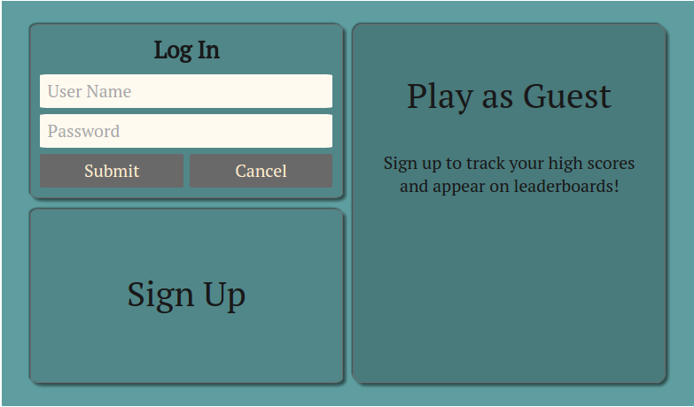

#<a href="https://memorycardgame.herokuapp.com/">Memory</a>

<a href="https://memorycardgame.herokuapp.com/"></img>

## Memory is a full-stack Rails/React game.  

<a href="https://memorycardgame.herokuapp.com/"></img>

##Features include:

* Fully responsive design, using Flexbox and media queries
* Optional user accounts for tracking high scores
* Leaderboard
* Sound effects and mute button
* Choice of two levels of difficulty, and three different card styles
* Timer

<a href="https://memorycardgame.herokuapp.com/"></img>

<a href="https://memorycardgame.herokuapp.com/"></img>
